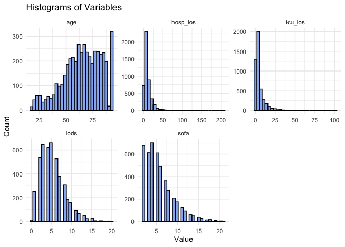
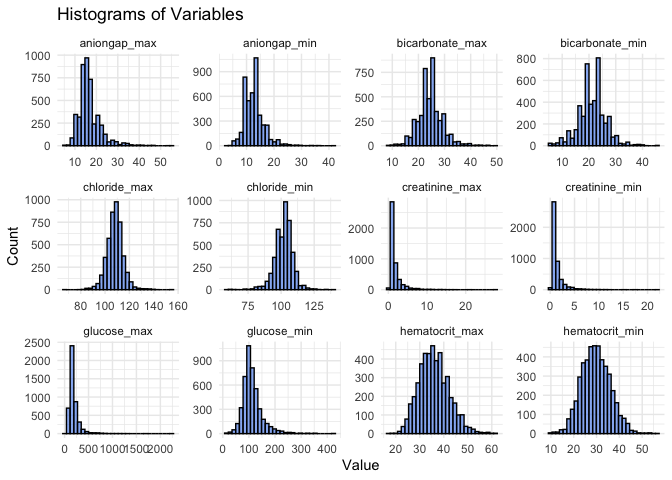
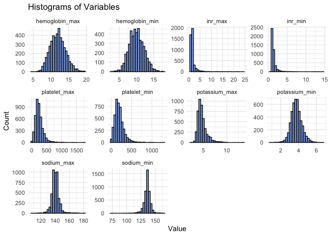
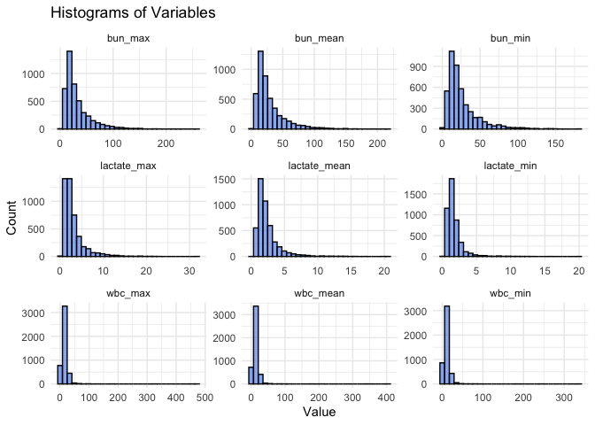
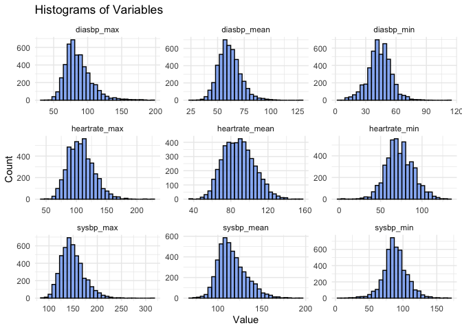
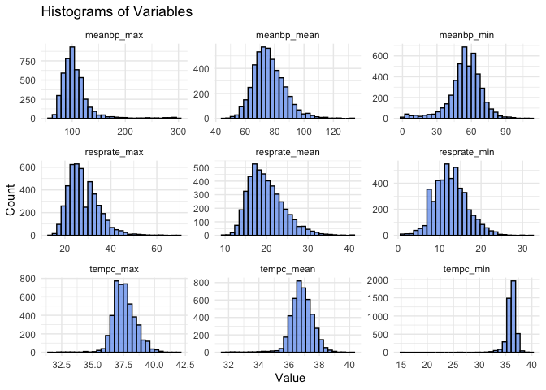
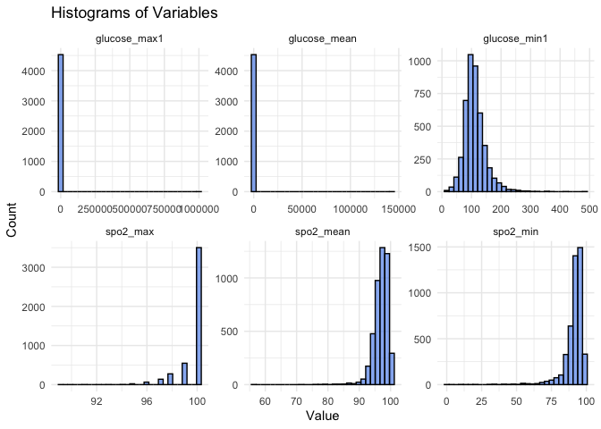

EDA
================
Christine Lucille Kuryla
2024-11-24

# Article

Hou, N., Li, M., He, L. et al. Predicting 30-days mortality for
MIMIC-III patients with sepsis-3: a machine learning approach using
XGboost. J Transl Med 18, 462 (2020).
<https://doi.org/10.1186/s12967-020-02620-5>

<https://translational-medicine.biomedcentral.com/articles/10.1186/s12967-020-02620-5>

## Data from online article

``` r
# Downloaded from: https://translational-medicine.biomedcentral.com/articles/10.1186/s12967-020-02620-5#Sec14

# This data has all of the patients included in the study, after they filtered out certain patients due to the exclusion criteria in the paper
# n = 4559

data <- read_csv("data/12967_2020_2620_MOESM1_ESM.csv")
```

    ## New names:
    ## Rows: 4559 Columns: 106
    ## ── Column specification
    ## ──────────────────────────────────────────────────────── Delimiter: "," chr
    ## (10): intime, outtime, dbsource, suspected_infection_time_poe, specimen_... dbl
    ## (96): icustay_id...1, hadm_id...2, suspected_infection_time_poe_days, po...
    ## ℹ Use `spec()` to retrieve the full column specification for this data. ℹ
    ## Specify the column types or set `show_col_types = FALSE` to quiet this message.
    ## • `icustay_id` -> `icustay_id...1`
    ## • `hadm_id` -> `hadm_id...2`
    ## • `hadm_id` -> `hadm_id...102`
    ## • `icustay_id` -> `icustay_id...103`

# Distributions

``` r
# Create histograms for each variable
data %>%
  #select(-c(icustay_id...1, hadm_id...2, icustay_id...103, hadm_id...102,
        #    intime, outtime, dbsource, suspected_infection_time_poe)) %>% #filter irrelevant variables
  select(
    age, icu_los, hosp_los, sofa, lods
  ) %>% 
  pivot_longer(cols = everything(), names_to = "variable", values_to = "value") %>%
  ggplot(aes(x = value)) +
  geom_histogram( fill = "cornflowerblue", alpha = 0.7, color = "black") +
  facet_wrap(~ variable, scales = "free") +
  theme_minimal() +
  labs(title = "Histograms of Variables", x = "Value", y = "Count")
```

    ## `stat_bin()` using `bins = 30`. Pick better value with `binwidth`.

<!-- -->

``` r
data %>%
  select(aniongap_min:hematocrit_max) %>% 
  pivot_longer(cols = everything(), names_to = "variable", values_to = "value") %>%
  ggplot(aes(x = value)) +
  geom_histogram(fill = "cornflowerblue", alpha = 0.7, color = "black") +
  facet_wrap(~ variable, scales = "free") +
  theme_minimal() +
  labs(title = "Histograms of Variables", x = "Value", y = "Count")
```

    ## `stat_bin()` using `bins = 30`. Pick better value with `binwidth`.

    ## Warning: Removed 46 rows containing non-finite outside the scale range
    ## (`stat_bin()`).

<!-- -->

``` r
data %>%
  select(hemoglobin_min, hemoglobin_max,
      #   lactate_mean, lactate_min, lactate_max,
         platelet_min, platelet_max,
         potassium_min, potassium_max,
         inr_min, inr_max,
      sodium_min, sodium_max
      ) %>% 
  pivot_longer(cols = everything(), names_to = "variable", values_to = "value") %>%
  ggplot(aes(x = value)) +
  geom_histogram(fill = "cornflowerblue", alpha = 0.7, color = "black") +
  facet_wrap(~ variable, scales = "free", ncol = 4) +
  theme_minimal() +
  labs(title = "Histograms of Variables", x = "Value", y = "Count")
```

    ## `stat_bin()` using `bins = 30`. Pick better value with `binwidth`.

    ## Warning: Removed 558 rows containing non-finite outside the scale range
    ## (`stat_bin()`).

<!-- -->

``` r
data %>%
  select(lactate_min:lactate_mean,
         bun_min:wbc_mean) %>% 
  pivot_longer(cols = everything(), names_to = "variable", values_to = "value") %>%
  ggplot(aes(x = value)) +
  geom_histogram(fill = "cornflowerblue", alpha = 0.7, color = "black") +
  facet_wrap(~ variable, scales = "free", ncol = 3) +
  theme_minimal() +
  labs(title = "Histograms of Variables", x = "Value", y = "Count")
```

    ## `stat_bin()` using `bins = 30`. Pick better value with `binwidth`.

    ## Warning: Removed 14 rows containing non-finite outside the scale range
    ## (`stat_bin()`).

<!-- -->

``` r
data %>%
  select(heartrate_min:diasbp_mean) %>% 
  pivot_longer(cols = everything(), names_to = "variable", values_to = "value") %>%
  ggplot(aes(x = value)) +
  geom_histogram(fill = "cornflowerblue", alpha = 0.7, color = "black") +
  facet_wrap(~ variable, scales = "free", ncol = 3) +
  theme_minimal() +
  labs(title = "Histograms of Variables", x = "Value", y = "Count")
```

    ## `stat_bin()` using `bins = 30`. Pick better value with `binwidth`.

    ## Warning: Removed 48 rows containing non-finite outside the scale range
    ## (`stat_bin()`).

<!-- -->

``` r
data %>%
  select(meanbp_min:tempc_mean) %>% 
  pivot_longer(cols = everything(), names_to = "variable", values_to = "value") %>%
  ggplot(aes(x = value)) +
  geom_histogram(fill = "cornflowerblue", alpha = 0.7, color = "black") +
  facet_wrap(~ variable, scales = "free", ncol = 3) +
  theme_minimal() +
  labs(title = "Histograms of Variables", x = "Value", y = "Count")
```

    ## `stat_bin()` using `bins = 30`. Pick better value with `binwidth`.

    ## Warning: Removed 312 rows containing non-finite outside the scale range
    ## (`stat_bin()`).

<!-- -->

``` r
data %>%
  select(spo2_min:glucose_mean) %>% 
  pivot_longer(cols = everything(), names_to = "variable", values_to = "value") %>%
  ggplot(aes(x = value)) +
  geom_histogram(fill = "cornflowerblue", alpha = 0.7, color = "black") +
  facet_wrap(~ variable, scales = "free", ncol = 3) +
  theme_minimal() +
  labs(title = "Histograms of Variables", x = "Value", y = "Count")
```

    ## `stat_bin()` using `bins = 30`. Pick better value with `binwidth`.

    ## Warning: Removed 93 rows containing non-finite outside the scale range
    ## (`stat_bin()`).

<!-- -->

# Summary Statistics

``` r
# Define summary statistics function
summarize_data <- function(data) {
  # Separate numeric and categorical columns
  numeric_vars <- data %>% select(where(is.numeric)) %>% names()
  categorical_vars <- data %>% select(where(~ is.character(.x) || is.factor(.x))) %>% names()
  
  # Summary for numeric variables
  numeric_summary <- data %>%
    select(all_of(numeric_vars)) %>%
    pivot_longer(cols = everything(), names_to = "variable", values_to = "value") %>%
    group_by(variable) %>%
    reframe(
      stats = if (all(value %in% c(0, 1), na.rm = TRUE)) {
        counts <- table(value)
        percentages <- prop.table(counts) * 100
        paste0(
          "Count: ", paste(names(counts), "=", counts, collapse = ", "), "; ",
          "Percentage: ", paste(names(percentages), "=", round(percentages, 2), "%", collapse = ", ")
        )
      } else {
        paste0(
          "Mean: ", round(mean(value, na.rm = TRUE), 2), "; ",
          "Median: ", round(median(value, na.rm = TRUE), 2), "; ",
          "SD: ", round(sd(value, na.rm = TRUE), 2), "; ",
          "Min: ", round(min(value, na.rm = TRUE), 2), "; ",
          "Max: ", round(max(value, na.rm = TRUE), 2)
        )
      }
    )
  
  # Summary for categorical variables
  categorical_summary <- data %>%
    select(all_of(categorical_vars)) %>%
    pivot_longer(cols = everything(), names_to = "variable", values_to = "value") %>%
    group_by(variable, value) %>%
    summarise(
      count = n(),
      percentage = round(n() / sum(n()) * 100, 2),
      .groups = "drop"
    ) %>%
    group_by(variable) %>%
    reframe(
      stats = paste0(
        value, ": Count ", count, "; Percentage ", percentage, "%", collapse = "; "
      )
    )
  
  # Combine summaries
  bind_rows(
    numeric_summary,
    categorical_summary
  )
}


# Define summary statistics function
summarize_data_table1 <- function(data) {
  numeric_vars <- data %>% select(where(is.numeric)) %>% names()
  categorical_vars <- data %>% select(where(~ is.character(.x) || is.factor(.x))) %>% names()
  
  # Numeric variables summary
  numeric_summary <- data %>%
    select(all_of(numeric_vars)) %>%
    pivot_longer(cols = everything(), names_to = "Variable", values_to = "Value") %>%
    group_by(Variable) %>%
    reframe(
      Summary = if (all(Value %in% c(0, 1), na.rm = TRUE)) {
        counts <- table(Value)
        percentages <- prop.table(counts) * 100
        paste0(
          paste(names(counts), " (", round(percentages, 2), "%)", collapse = ", ")
        )
      } else {
        paste0(
          "Mean: ", round(mean(Value, na.rm = TRUE), 2), ", ",
          "Median: ", round(median(Value, na.rm = TRUE), 2), ", ",
          "SD: ", round(sd(Value, na.rm = TRUE), 2), ", ",
          "Min: ", round(min(Value, na.rm = TRUE), 2), ", ",
          "Max: ", round(max(Value, na.rm = TRUE), 2)
        )
      }
    )
  
  # Categorical variables summary
  categorical_summary <- data %>%
    select(all_of(categorical_vars)) %>%
    pivot_longer(cols = everything(), names_to = "Variable", values_to = "Value") %>%
    group_by(Variable, Value) %>%
    summarise(
      Count = n(),
      Percentage = round(n() / sum(n()) * 100, 2),
      .groups = "drop"
    ) %>%
    group_by(Variable) %>%
    reframe(
      Summary = paste0(
        Value, " (", Count, ", ", Percentage, "%)", collapse = "; "
      )
    )
  
  # Combine summaries
  bind_rows(
    numeric_summary,
    categorical_summary
  )
}

# Run the function on the example dataset
summary_stats <- summarize_data(data %>% 
                                  select(-c(icustay_id...1, hadm_id...2, icustay_id...103, hadm_id...102,intime, outtime, dbsource, blood_culture_time, antibiotic_time_poe, suspected_infection_time_poe)))

# View the result
knitr::kable(summary_stats)
```

| variable | stats |
|:---|:---|
| age | Mean: 65.13; Median: 66.59; SD: 17.67; Min: 16.78; Max: 91.4 |
| aniongap_max | Mean: 16.67; Median: 16; SD: 5.12; Min: 6; Max: 56 |
| aniongap_min | Mean: 12.82; Median: 12; SD: 3.54; Min: 3; Max: 42 |
| bicarbonate_max | Mean: 24.54; Median: 24; SD: 4.65; Min: 8; Max: 49 |
| bicarbonate_min | Mean: 21.27; Median: 21; SD: 5.11; Min: 5; Max: 45 |
| blood_culture_positive | Count: 0 = 2822, 1 = 1737; Percentage: 0 = 61.9 %, 1 = 38.1 % |
| bun_max | Mean: 32.25; Median: 24; SD: 25.62; Min: 3; Max: 261 |
| bun_mean | Mean: 29.23; Median: 21.5; SD: 23.22; Min: 0; Max: 216.5 |
| bun_min | Mean: 26.25; Median: 19; SD: 21.4; Min: 1; Max: 182 |
| chloride_max | Mean: 107.96; Median: 108; SD: 6.69; Min: 67; Max: 155 |
| chloride_min | Mean: 101.86; Median: 102; SD: 6.86; Min: 58; Max: 139 |
| colloid_bolus | Mean: 382.43; Median: 500; SD: 134.93; Min: 150; Max: 1000 |
| creatinine_max | Mean: 1.73; Median: 1.2; SD: 1.73; Min: 0.1; Max: 27.8 |
| creatinine_min | Mean: 1.36; Median: 1; SD: 1.29; Min: 0.1; Max: 22.1 |
| crystalloid_bolus | Mean: 645.72; Median: 500; SD: 369.98; Min: 250; Max: 11000 |
| diabetes | Count: 0 = 3281, 1 = 1278; Percentage: 0 = 71.97 %, 1 = 28.03 % |
| diasbp_max | Mean: 86.14; Median: 83; SD: 19.34; Min: 35; Max: 197 |
| diasbp_mean | Mean: 61.04; Median: 60.3; SD: 10.27; Min: 26.33; Max: 129.57 |
| diasbp_min | Mean: 43.66; Median: 44; SD: 11.32; Min: 5; Max: 114 |
| elixhauser_hospital | Mean: 3.9; Median: 4; SD: 7.08; Min: -23; Max: 30 |
| glucose_max | Mean: 188.86; Median: 161; SD: 112.15; Min: 38; Max: 2275 |
| glucose_max1 | Mean: 410.82; Median: 166; SD: 14856.78; Min: 57; Max: 999999 |
| glucose_mean | Mean: 177.22; Median: 134.19; SD: 2122.84; Min: 52.44; Max: 142966.86 |
| glucose_min | Mean: 112.78; Median: 106; SD: 38.69; Min: 15; Max: 425 |
| glucose_min1 | Mean: 111.23; Median: 106; SD: 36.76; Min: 12; Max: 480 |
| heartrate_max | Mean: 107.55; Median: 106; SD: 21.05; Min: 41; Max: 223 |
| heartrate_mean | Mean: 88.44; Median: 87.78; SD: 16.63; Min: 35.78; Max: 154.53 |
| heartrate_min | Mean: 73.09; Median: 72; SD: 16.49; Min: 1; Max: 134 |
| hematocrit_max | Mean: 35.94; Median: 35.6; SD: 6.22; Min: 16.4; Max: 61 |
| hematocrit_min | Mean: 29.71; Median: 29.5; SD: 6.28; Min: 9; Max: 55.9 |
| hemoglobin_max | Mean: 11.94; Median: 11.85; SD: 2.13; Min: 4.8; Max: 19.6 |
| hemoglobin_min | Mean: 10; Median: 9.9; SD: 2.13; Min: 2.7; Max: 18 |
| hosp_los | Mean: 10.51; Median: 7.79; SD: 9.98; Min: -0.43; Max: 206.43 |
| hospital_expire_flag | Count: 0 = 3818, 1 = 741; Percentage: 0 = 83.75 %, 1 = 16.25 % |
| icu_los | Mean: 5.03; Median: 2.82; SD: 6.34; Min: 0.17; Max: 101.74 |
| inr_max | Mean: 1.71; Median: 1.3; SD: 1.45; Min: 0.6; Max: 24 |
| inr_min | Mean: 1.39; Median: 1.2; SD: 0.67; Min: 0.6; Max: 14.6 |
| is_male | Count: 0 = 1978, 1 = 2581; Percentage: 0 = 43.39 %, 1 = 56.61 % |
| lactate_max | Mean: 3.02; Median: 2.2; SD: 2.57; Min: 0.3; Max: 32 |
| lactate_mean | Mean: 2.37; Median: 1.9; SD: 1.74; Min: 0.3; Max: 20.85 |
| lactate_min | Mean: 1.72; Median: 1.4; SD: 1.21; Min: 0.3; Max: 20.3 |
| lods | Mean: 5.27; Median: 5; SD: 2.98; Min: 0; Max: 20 |
| meanbp_max | Mean: 106.11; Median: 101; SD: 29.05; Min: 56; Max: 298 |
| meanbp_mean | Mean: 76.17; Median: 75; SD: 10.5; Min: 45.6; Max: 133.16 |
| meanbp_min | Mean: 54.74; Median: 56; SD: 14.49; Min: 1; Max: 113 |
| metastatic_cancer | Count: 0 = 4282, 1 = 277; Percentage: 0 = 93.92 %, 1 = 6.08 % |
| platelet_max | Mean: 245.64; Median: 224; SD: 132.11; Min: 16; Max: 1775 |
| platelet_min | Mean: 195.94; Median: 178; SD: 113.68; Min: 5; Max: 1297 |
| positiveculture_poe | Count: 0 = 3938, 1 = 621; Percentage: 0 = 86.38 %, 1 = 13.62 % |
| potassium_max | Mean: 4.73; Median: 4.5; SD: 0.97; Min: 2.3; Max: 13.5 |
| potassium_min | Mean: 3.74; Median: 3.7; SD: 0.58; Min: 0.9; Max: 6.8 |
| qsofa | Mean: 1.95; Median: 2; SD: 0.68; Min: 0; Max: 3 |
| qsofa_gcs_score | Mean: 0.28; Median: 0; SD: 0.45; Min: 0; Max: 1 |
| qsofa_resprate_score | Mean: 0.88; Median: 1; SD: 0.33; Min: 0; Max: 1 |
| qsofa_sysbp_score | Mean: 0.79; Median: 1; SD: 0.41; Min: 0; Max: 1 |
| race_black | Count: 0 = 4166, 1 = 393; Percentage: 0 = 91.38 %, 1 = 8.62 % |
| race_hispanic | Count: 0 = 4408, 1 = 151; Percentage: 0 = 96.69 %, 1 = 3.31 % |
| race_other | Count: 0 = 3820, 1 = 739; Percentage: 0 = 83.79 %, 1 = 16.21 % |
| race_white | Count: 0 = 1283, 1 = 3276; Percentage: 0 = 28.14 %, 1 = 71.86 % |
| resprate_max | Mean: 28.2; Median: 27; SD: 6.46; Min: 13; Max: 69 |
| resprate_mean | Mean: 19.92; Median: 19.26; SD: 4.28; Min: 9.54; Max: 40.58 |
| resprate_min | Mean: 12.82; Median: 13; SD: 3.88; Min: 1; Max: 32 |
| rrt | Count: 0 = 4360, 1 = 199; Percentage: 0 = 95.64 %, 1 = 4.36 % |
| sepsis_angus | Count: 0 = 2136, 1 = 2423; Percentage: 0 = 46.85 %, 1 = 53.15 % |
| sepsis_cdc | Count: 0 = 1555, 1 = 3004; Percentage: 0 = 34.11 %, 1 = 65.89 % |
| sepsis_cdc_simple | Count: 0 = 1932, 1 = 2627; Percentage: 0 = 42.38 %, 1 = 57.62 % |
| sepsis_explicit | Count: 0 = 3629, 1 = 930; Percentage: 0 = 79.6 %, 1 = 20.4 % |
| sepsis_martin | Count: 0 = 3173, 1 = 1386; Percentage: 0 = 69.6 %, 1 = 30.4 % |
| sepsis_nqf | Count: 0 = 3436, 1 = 1123; Percentage: 0 = 75.37 %, 1 = 24.63 % |
| septic_shock_explicit | Count: 0 = 3862, 1 = 697; Percentage: 0 = 84.71 %, 1 = 15.29 % |
| severe_sepsis_explicit | Count: 0 = 3630, 1 = 929; Percentage: 0 = 79.62 %, 1 = 20.38 % |
| sirs | Mean: 3.01; Median: 3; SD: 0.88; Min: 0; Max: 4 |
| sodium_max | Mean: 140.5; Median: 140; SD: 5.43; Min: 108; Max: 182 |
| sodium_min | Mean: 135.99; Median: 136; SD: 5.62; Min: 74; Max: 166 |
| sofa | Mean: 5.75; Median: 5; SD: 3.35; Min: 2; Max: 21 |
| spo2_max | Mean: 99.57; Median: 100; SD: 0.97; Min: 89; Max: 100 |
| spo2_mean | Mean: 96.91; Median: 97.26; SD: 2.48; Min: 55.87; Max: 100 |
| spo2_min | Mean: 91.08; Median: 93; SD: 7.81; Min: 1; Max: 100 |
| subject_id | Mean: 68163.64; Median: 68368; SD: 18480.54; Min: 165; Max: 99982 |
| suspected_infection_time_poe_days | Mean: 0.08; Median: 0.03; SD: 0.29; Min: -0.99; Max: 1 |
| sysbp_max | Mean: 148.61; Median: 146; SD: 23.86; Min: 83; Max: 311 |
| sysbp_mean | Mean: 116.22; Median: 113.61; SD: 15.99; Min: 69.88; Max: 195.34 |
| sysbp_min | Mean: 88.51; Median: 88; SD: 17.33; Min: 5; Max: 168 |
| tempc_max | Mean: 37.58; Median: 37.5; SD: 0.92; Min: 31.6; Max: 42 |
| tempc_mean | Mean: 36.85; Median: 36.82; SD: 0.74; Min: 31.6; Max: 40.1 |
| tempc_min | Mean: 36.08; Median: 36.11; SD: 0.93; Min: 15; Max: 39.6 |
| thirtyday_expire_flag | Count: 0 = 3670, 1 = 889; Percentage: 0 = 80.5 %, 1 = 19.5 % |
| urineoutput | Mean: 1843.33; Median: 1560; SD: 1537.36; Min: 0; Max: 50515 |
| vent | Count: 0 = 2027, 1 = 2532; Percentage: 0 = 44.46 %, 1 = 55.54 % |
| wbc_max | Mean: 15.41; Median: 13.6; SD: 13.91; Min: 0.1; Max: 471.7 |
| wbc_mean | Mean: 13.14; Median: 11.75; SD: 11.29; Min: 0; Max: 404.2 |
| wbc_min | Mean: 10.89; Median: 9.6; SD: 9.28; Min: 0.1; Max: 336.7 |
| ethnicity | AMERICAN INDIAN/ALASKA NATIVE: Count 4; Percentage 100%; AMERICAN INDIAN/ALASKA NATIVE FEDERALLY RECOGNIZED TRIBE: Count 1; Percentage 100%; ASIAN: Count 69; Percentage 100%; ASIAN - ASIAN INDIAN: Count 11; Percentage 100%; ASIAN - CAMBODIAN: Count 3; Percentage 100%; ASIAN - CHINESE: Count 42; Percentage 100%; ASIAN - FILIPINO: Count 3; Percentage 100%; ASIAN - JAPANESE: Count 2; Percentage 100%; ASIAN - KOREAN: Count 2; Percentage 100%; ASIAN - OTHER: Count 3; Percentage 100%; ASIAN - THAI: Count 1; Percentage 100%; ASIAN - VIETNAMESE: Count 7; Percentage 100%; BLACK/AFRICAN: Count 9; Percentage 100%; BLACK/AFRICAN AMERICAN: Count 331; Percentage 100%; BLACK/CAPE VERDEAN: Count 41; Percentage 100%; BLACK/HAITIAN: Count 11; Percentage 100%; CARIBBEAN ISLAND: Count 1; Percentage 100%; HISPANIC OR LATINO: Count 109; Percentage 100%; HISPANIC/LATINO - CENTRAL AMERICAN (OTHER): Count 1; Percentage 100%; HISPANIC/LATINO - COLOMBIAN: Count 1; Percentage 100%; HISPANIC/LATINO - CUBAN: Count 5; Percentage 100%; HISPANIC/LATINO - DOMINICAN: Count 5; Percentage 100%; HISPANIC/LATINO - GUATEMALAN: Count 2; Percentage 100%; HISPANIC/LATINO - HONDURAN: Count 2; Percentage 100%; HISPANIC/LATINO - MEXICAN: Count 3; Percentage 100%; HISPANIC/LATINO - PUERTO RICAN: Count 22; Percentage 100%; HISPANIC/LATINO - SALVADORAN: Count 1; Percentage 100%; MIDDLE EASTERN: Count 8; Percentage 100%; MULTI RACE ETHNICITY: Count 17; Percentage 100%; NATIVE HAWAIIAN OR OTHER PACIFIC ISLANDER: Count 3; Percentage 100%; OTHER: Count 138; Percentage 100%; PATIENT DECLINED TO ANSWER: Count 45; Percentage 100%; PORTUGUESE: Count 9; Percentage 100%; SOUTH AMERICAN: Count 1; Percentage 100%; UNABLE TO OBTAIN: Count 181; Percentage 100%; UNKNOWN/NOT SPECIFIED: Count 189; Percentage 100%; WHITE: Count 3233; Percentage 100%; WHITE - BRAZILIAN: Count 5; Percentage 100%; WHITE - EASTERN EUROPEAN: Count 5; Percentage 100%; WHITE - OTHER EUROPEAN: Count 11; Percentage 100%; WHITE - RUSSIAN: Count 22; Percentage 100% |
| first_service | CMED: Count 563; Percentage 100%; ENT: Count 12; Percentage 100%; GU: Count 35; Percentage 100%; GYN: Count 16; Percentage 100%; MED: Count 2557; Percentage 100%; NMED: Count 136; Percentage 100%; NSURG: Count 298; Percentage 100%; OBS: Count 8; Percentage 100%; OMED: Count 80; Percentage 100%; ORTHO: Count 90; Percentage 100%; PSURG: Count 9; Percentage 100%; SURG: Count 453; Percentage 100%; TRAUM: Count 302; Percentage 100% |
| gender | F: Count 1978; Percentage 100%; M: Count 2581; Percentage 100% |
| specimen_poe | ABSCESS: Count 3; Percentage 100%; BILE: Count 2; Percentage 100%; BLOOD CULTURE: Count 1931; Percentage 100%; BLOOD CULTURE ( MYCO/F LYTIC BOTTLE): Count 3; Percentage 100%; BRONCHIAL WASHINGS: Count 4; Percentage 100%; BRONCHOALVEOLAR LAVAGE: Count 3; Percentage 100%; Blood (CMV AB): Count 9; Percentage 100%; Blood (EBV): Count 3; Percentage 100%; Blood (Malaria): Count 1; Percentage 100%; Blood (Toxo): Count 3; Percentage 100%; CATHETER TIP-IV: Count 4; Percentage 100%; CSF;SPINAL FLUID: Count 22; Percentage 100%; DIALYSIS FLUID: Count 1; Percentage 100%; FLUID RECEIVED IN BLOOD CULTURE BOTTLES: Count 4; Percentage 100%; FLUID,OTHER: Count 9; Percentage 100%; FOREIGN BODY: Count 1; Percentage 100%; IMMUNOLOGY: Count 14; Percentage 100%; Immunology (CMV): Count 3; Percentage 100%; Influenza A/B by DFA: Count 14; Percentage 100%; JOINT FLUID: Count 1; Percentage 100%; MRSA SCREEN: Count 1480; Percentage 100%; Mini-BAL: Count 1; Percentage 100%; NEOPLASTIC BLOOD: Count 3; Percentage 100%; PERITONEAL FLUID: Count 10; Percentage 100%; PLEURAL FLUID: Count 3; Percentage 100%; RAPID RESPIRATORY VIRAL ANTIGEN TEST: Count 1; Percentage 100%; Rapid Respiratory Viral Screen & Culture: Count 4; Percentage 100%; SEROLOGY/BLOOD: Count 29; Percentage 100%; SPUTUM: Count 50; Percentage 100%; STOOL: Count 18; Percentage 100%; SWAB: Count 93; Percentage 100%; Staph aureus Screen: Count 41; Percentage 100%; TISSUE: Count 20; Percentage 100%; URINE: Count 770; Percentage 100%; URINE,KIDNEY: Count 1; Percentage 100% |

``` r
# Generate the Table 1
table1 <- summarize_data_table1(data %>% 
                                  select(-c(icustay_id...1, hadm_id...2, icustay_id...103, hadm_id...102,intime, outtime, dbsource, blood_culture_time,antibiotic_time_poe, suspected_infection_time_poe)))

# Display Table 1
knitr::kable(
  table1,
  col.names = c("Variable", "Summary"),
  caption = "Table 1: Summary Statistics"
)
```

| Variable | Summary |
|:---|:---|
| age | Mean: 65.13, Median: 66.59, SD: 17.67, Min: 16.78, Max: 91.4 |
| aniongap_max | Mean: 16.67, Median: 16, SD: 5.12, Min: 6, Max: 56 |
| aniongap_min | Mean: 12.82, Median: 12, SD: 3.54, Min: 3, Max: 42 |
| bicarbonate_max | Mean: 24.54, Median: 24, SD: 4.65, Min: 8, Max: 49 |
| bicarbonate_min | Mean: 21.27, Median: 21, SD: 5.11, Min: 5, Max: 45 |
| blood_culture_positive | 0 ( 61.9 %), 1 ( 38.1 %) |
| bun_max | Mean: 32.25, Median: 24, SD: 25.62, Min: 3, Max: 261 |
| bun_mean | Mean: 29.23, Median: 21.5, SD: 23.22, Min: 0, Max: 216.5 |
| bun_min | Mean: 26.25, Median: 19, SD: 21.4, Min: 1, Max: 182 |
| chloride_max | Mean: 107.96, Median: 108, SD: 6.69, Min: 67, Max: 155 |
| chloride_min | Mean: 101.86, Median: 102, SD: 6.86, Min: 58, Max: 139 |
| colloid_bolus | Mean: 382.43, Median: 500, SD: 134.93, Min: 150, Max: 1000 |
| creatinine_max | Mean: 1.73, Median: 1.2, SD: 1.73, Min: 0.1, Max: 27.8 |
| creatinine_min | Mean: 1.36, Median: 1, SD: 1.29, Min: 0.1, Max: 22.1 |
| crystalloid_bolus | Mean: 645.72, Median: 500, SD: 369.98, Min: 250, Max: 11000 |
| diabetes | 0 ( 71.97 %), 1 ( 28.03 %) |
| diasbp_max | Mean: 86.14, Median: 83, SD: 19.34, Min: 35, Max: 197 |
| diasbp_mean | Mean: 61.04, Median: 60.3, SD: 10.27, Min: 26.33, Max: 129.57 |
| diasbp_min | Mean: 43.66, Median: 44, SD: 11.32, Min: 5, Max: 114 |
| elixhauser_hospital | Mean: 3.9, Median: 4, SD: 7.08, Min: -23, Max: 30 |
| glucose_max | Mean: 188.86, Median: 161, SD: 112.15, Min: 38, Max: 2275 |
| glucose_max1 | Mean: 410.82, Median: 166, SD: 14856.78, Min: 57, Max: 999999 |
| glucose_mean | Mean: 177.22, Median: 134.19, SD: 2122.84, Min: 52.44, Max: 142966.86 |
| glucose_min | Mean: 112.78, Median: 106, SD: 38.69, Min: 15, Max: 425 |
| glucose_min1 | Mean: 111.23, Median: 106, SD: 36.76, Min: 12, Max: 480 |
| heartrate_max | Mean: 107.55, Median: 106, SD: 21.05, Min: 41, Max: 223 |
| heartrate_mean | Mean: 88.44, Median: 87.78, SD: 16.63, Min: 35.78, Max: 154.53 |
| heartrate_min | Mean: 73.09, Median: 72, SD: 16.49, Min: 1, Max: 134 |
| hematocrit_max | Mean: 35.94, Median: 35.6, SD: 6.22, Min: 16.4, Max: 61 |
| hematocrit_min | Mean: 29.71, Median: 29.5, SD: 6.28, Min: 9, Max: 55.9 |
| hemoglobin_max | Mean: 11.94, Median: 11.85, SD: 2.13, Min: 4.8, Max: 19.6 |
| hemoglobin_min | Mean: 10, Median: 9.9, SD: 2.13, Min: 2.7, Max: 18 |
| hosp_los | Mean: 10.51, Median: 7.79, SD: 9.98, Min: -0.43, Max: 206.43 |
| hospital_expire_flag | 0 ( 83.75 %), 1 ( 16.25 %) |
| icu_los | Mean: 5.03, Median: 2.82, SD: 6.34, Min: 0.17, Max: 101.74 |
| inr_max | Mean: 1.71, Median: 1.3, SD: 1.45, Min: 0.6, Max: 24 |
| inr_min | Mean: 1.39, Median: 1.2, SD: 0.67, Min: 0.6, Max: 14.6 |
| is_male | 0 ( 43.39 %), 1 ( 56.61 %) |
| lactate_max | Mean: 3.02, Median: 2.2, SD: 2.57, Min: 0.3, Max: 32 |
| lactate_mean | Mean: 2.37, Median: 1.9, SD: 1.74, Min: 0.3, Max: 20.85 |
| lactate_min | Mean: 1.72, Median: 1.4, SD: 1.21, Min: 0.3, Max: 20.3 |
| lods | Mean: 5.27, Median: 5, SD: 2.98, Min: 0, Max: 20 |
| meanbp_max | Mean: 106.11, Median: 101, SD: 29.05, Min: 56, Max: 298 |
| meanbp_mean | Mean: 76.17, Median: 75, SD: 10.5, Min: 45.6, Max: 133.16 |
| meanbp_min | Mean: 54.74, Median: 56, SD: 14.49, Min: 1, Max: 113 |
| metastatic_cancer | 0 ( 93.92 %), 1 ( 6.08 %) |
| platelet_max | Mean: 245.64, Median: 224, SD: 132.11, Min: 16, Max: 1775 |
| platelet_min | Mean: 195.94, Median: 178, SD: 113.68, Min: 5, Max: 1297 |
| positiveculture_poe | 0 ( 86.38 %), 1 ( 13.62 %) |
| potassium_max | Mean: 4.73, Median: 4.5, SD: 0.97, Min: 2.3, Max: 13.5 |
| potassium_min | Mean: 3.74, Median: 3.7, SD: 0.58, Min: 0.9, Max: 6.8 |
| qsofa | Mean: 1.95, Median: 2, SD: 0.68, Min: 0, Max: 3 |
| qsofa_gcs_score | Mean: 0.28, Median: 0, SD: 0.45, Min: 0, Max: 1 |
| qsofa_resprate_score | Mean: 0.88, Median: 1, SD: 0.33, Min: 0, Max: 1 |
| qsofa_sysbp_score | Mean: 0.79, Median: 1, SD: 0.41, Min: 0, Max: 1 |
| race_black | 0 ( 91.38 %), 1 ( 8.62 %) |
| race_hispanic | 0 ( 96.69 %), 1 ( 3.31 %) |
| race_other | 0 ( 83.79 %), 1 ( 16.21 %) |
| race_white | 0 ( 28.14 %), 1 ( 71.86 %) |
| resprate_max | Mean: 28.2, Median: 27, SD: 6.46, Min: 13, Max: 69 |
| resprate_mean | Mean: 19.92, Median: 19.26, SD: 4.28, Min: 9.54, Max: 40.58 |
| resprate_min | Mean: 12.82, Median: 13, SD: 3.88, Min: 1, Max: 32 |
| rrt | 0 ( 95.64 %), 1 ( 4.36 %) |
| sepsis_angus | 0 ( 46.85 %), 1 ( 53.15 %) |
| sepsis_cdc | 0 ( 34.11 %), 1 ( 65.89 %) |
| sepsis_cdc_simple | 0 ( 42.38 %), 1 ( 57.62 %) |
| sepsis_explicit | 0 ( 79.6 %), 1 ( 20.4 %) |
| sepsis_martin | 0 ( 69.6 %), 1 ( 30.4 %) |
| sepsis_nqf | 0 ( 75.37 %), 1 ( 24.63 %) |
| septic_shock_explicit | 0 ( 84.71 %), 1 ( 15.29 %) |
| severe_sepsis_explicit | 0 ( 79.62 %), 1 ( 20.38 %) |
| sirs | Mean: 3.01, Median: 3, SD: 0.88, Min: 0, Max: 4 |
| sodium_max | Mean: 140.5, Median: 140, SD: 5.43, Min: 108, Max: 182 |
| sodium_min | Mean: 135.99, Median: 136, SD: 5.62, Min: 74, Max: 166 |
| sofa | Mean: 5.75, Median: 5, SD: 3.35, Min: 2, Max: 21 |
| spo2_max | Mean: 99.57, Median: 100, SD: 0.97, Min: 89, Max: 100 |
| spo2_mean | Mean: 96.91, Median: 97.26, SD: 2.48, Min: 55.87, Max: 100 |
| spo2_min | Mean: 91.08, Median: 93, SD: 7.81, Min: 1, Max: 100 |
| subject_id | Mean: 68163.64, Median: 68368, SD: 18480.54, Min: 165, Max: 99982 |
| suspected_infection_time_poe_days | Mean: 0.08, Median: 0.03, SD: 0.29, Min: -0.99, Max: 1 |
| sysbp_max | Mean: 148.61, Median: 146, SD: 23.86, Min: 83, Max: 311 |
| sysbp_mean | Mean: 116.22, Median: 113.61, SD: 15.99, Min: 69.88, Max: 195.34 |
| sysbp_min | Mean: 88.51, Median: 88, SD: 17.33, Min: 5, Max: 168 |
| tempc_max | Mean: 37.58, Median: 37.5, SD: 0.92, Min: 31.6, Max: 42 |
| tempc_mean | Mean: 36.85, Median: 36.82, SD: 0.74, Min: 31.6, Max: 40.1 |
| tempc_min | Mean: 36.08, Median: 36.11, SD: 0.93, Min: 15, Max: 39.6 |
| thirtyday_expire_flag | 0 ( 80.5 %), 1 ( 19.5 %) |
| urineoutput | Mean: 1843.33, Median: 1560, SD: 1537.36, Min: 0, Max: 50515 |
| vent | 0 ( 44.46 %), 1 ( 55.54 %) |
| wbc_max | Mean: 15.41, Median: 13.6, SD: 13.91, Min: 0.1, Max: 471.7 |
| wbc_mean | Mean: 13.14, Median: 11.75, SD: 11.29, Min: 0, Max: 404.2 |
| wbc_min | Mean: 10.89, Median: 9.6, SD: 9.28, Min: 0.1, Max: 336.7 |
| ethnicity | AMERICAN INDIAN/ALASKA NATIVE (4, 100%); AMERICAN INDIAN/ALASKA NATIVE FEDERALLY RECOGNIZED TRIBE (1, 100%); ASIAN (69, 100%); ASIAN - ASIAN INDIAN (11, 100%); ASIAN - CAMBODIAN (3, 100%); ASIAN - CHINESE (42, 100%); ASIAN - FILIPINO (3, 100%); ASIAN - JAPANESE (2, 100%); ASIAN - KOREAN (2, 100%); ASIAN - OTHER (3, 100%); ASIAN - THAI (1, 100%); ASIAN - VIETNAMESE (7, 100%); BLACK/AFRICAN (9, 100%); BLACK/AFRICAN AMERICAN (331, 100%); BLACK/CAPE VERDEAN (41, 100%); BLACK/HAITIAN (11, 100%); CARIBBEAN ISLAND (1, 100%); HISPANIC OR LATINO (109, 100%); HISPANIC/LATINO - CENTRAL AMERICAN (OTHER) (1, 100%); HISPANIC/LATINO - COLOMBIAN (1, 100%); HISPANIC/LATINO - CUBAN (5, 100%); HISPANIC/LATINO - DOMINICAN (5, 100%); HISPANIC/LATINO - GUATEMALAN (2, 100%); HISPANIC/LATINO - HONDURAN (2, 100%); HISPANIC/LATINO - MEXICAN (3, 100%); HISPANIC/LATINO - PUERTO RICAN (22, 100%); HISPANIC/LATINO - SALVADORAN (1, 100%); MIDDLE EASTERN (8, 100%); MULTI RACE ETHNICITY (17, 100%); NATIVE HAWAIIAN OR OTHER PACIFIC ISLANDER (3, 100%); OTHER (138, 100%); PATIENT DECLINED TO ANSWER (45, 100%); PORTUGUESE (9, 100%); SOUTH AMERICAN (1, 100%); UNABLE TO OBTAIN (181, 100%); UNKNOWN/NOT SPECIFIED (189, 100%); WHITE (3233, 100%); WHITE - BRAZILIAN (5, 100%); WHITE - EASTERN EUROPEAN (5, 100%); WHITE - OTHER EUROPEAN (11, 100%); WHITE - RUSSIAN (22, 100%) |
| first_service | CMED (563, 100%); ENT (12, 100%); GU (35, 100%); GYN (16, 100%); MED (2557, 100%); NMED (136, 100%); NSURG (298, 100%); OBS (8, 100%); OMED (80, 100%); ORTHO (90, 100%); PSURG (9, 100%); SURG (453, 100%); TRAUM (302, 100%) |
| gender | F (1978, 100%); M (2581, 100%) |
| specimen_poe | ABSCESS (3, 100%); BILE (2, 100%); BLOOD CULTURE (1931, 100%); BLOOD CULTURE ( MYCO/F LYTIC BOTTLE) (3, 100%); BRONCHIAL WASHINGS (4, 100%); BRONCHOALVEOLAR LAVAGE (3, 100%); Blood (CMV AB) (9, 100%); Blood (EBV) (3, 100%); Blood (Malaria) (1, 100%); Blood (Toxo) (3, 100%); CATHETER TIP-IV (4, 100%); CSF;SPINAL FLUID (22, 100%); DIALYSIS FLUID (1, 100%); FLUID RECEIVED IN BLOOD CULTURE BOTTLES (4, 100%); FLUID,OTHER (9, 100%); FOREIGN BODY (1, 100%); IMMUNOLOGY (14, 100%); Immunology (CMV) (3, 100%); Influenza A/B by DFA (14, 100%); JOINT FLUID (1, 100%); MRSA SCREEN (1480, 100%); Mini-BAL (1, 100%); NEOPLASTIC BLOOD (3, 100%); PERITONEAL FLUID (10, 100%); PLEURAL FLUID (3, 100%); RAPID RESPIRATORY VIRAL ANTIGEN TEST (1, 100%); Rapid Respiratory Viral Screen & Culture (4, 100%); SEROLOGY/BLOOD (29, 100%); SPUTUM (50, 100%); STOOL (18, 100%); SWAB (93, 100%); Staph aureus Screen (41, 100%); TISSUE (20, 100%); URINE (770, 100%); URINE,KIDNEY (1, 100%) |

Table 1: Summary Statistics
